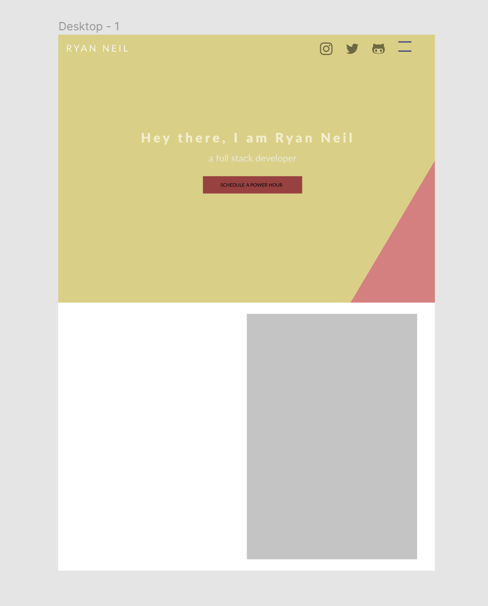
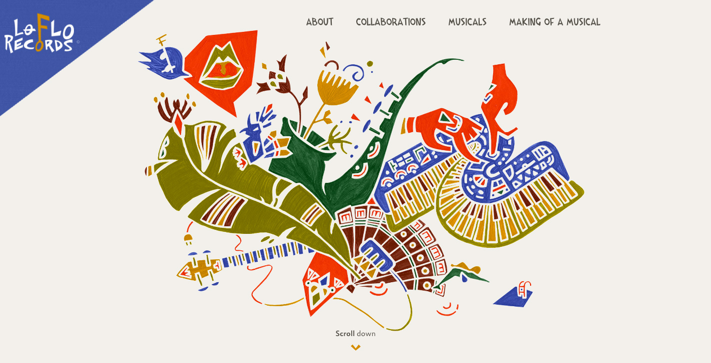

# Homework-2-Portfolio
### Portfolio for Ryan Neil

URL to my portfolio: https://vegaryanneil.github.io/Homework-2-Portfolio/
URL to my GitHub Repository: https://github.com/vegaryanneil/Homework-2-Portfolio

The portfolio has 4 main sections
1. Landing
2. About Me
3. Portfolio
4. Contact Me

I made a wireframe of the landing in Figma.

The color scheme was inspired by a color palette found from awwwards.com.

For the Landing page, I felt it was boring so I opted to add animation effects such as the typing effect to add some life into the project. I also added an ease in effect to the button.

The About Me image was an image taken from one of my trips and then filtered through an app that creates a cartoon version of the image.

In the portfolio, I utilized other websites from awwards.com as placeholders for my work. I did not actually create those works.

The image used in the contact me was from pexels.com. I removed the background using Canva then resized the photo.

The icons were sourced from flaticons.com.

 I was torn with what direction to take my website. I wasn't sure if I wanted to create something flashy, or minimal. I feel like I fell closer to minimal. There is definitely more work to be done with the design. I hope you enjoy browsing through.
